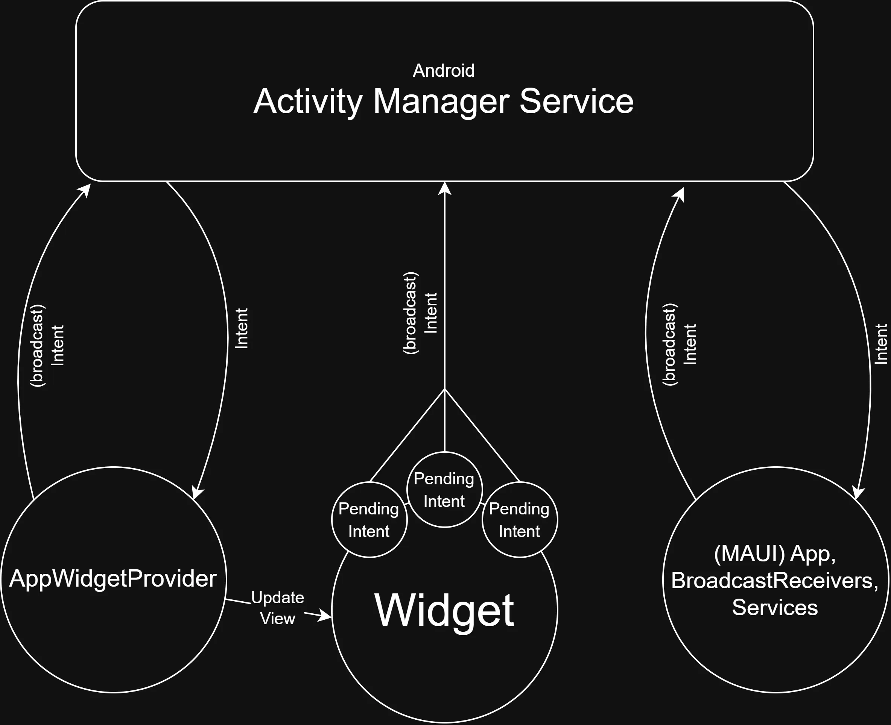

# Android Widgets in .NET MAUI

Due to great differences in implemntation between platforms, widgets are entirely written in native code.



## Overview

- .NET MAUI has no cross-platform widget abstraction.
- Android widgets are App Widgets hosted by the launcher (home screen), not by the MAUI visual tree.
- Widget UI must be described using Android RemoteViews (XML + limited runtime updates), which support a limited set of Android views.
    - Can have simple `Button`s or `ImageButton`s, more components available with API 31 (Android 12+)
- Communicates wiht main MAUI application through `Intent`s, hold data for things that happen in the widget.

## Approaches

- Rewrite views as native code:
    - Difficult, needs complete rebuild of a view from scratch
    - XML for widget page 
    - AppWidgetProvider can be written in C#, part of Android platform-specific code
- Dynamically changing widget
    - Can be done, still needs to be written as an XML, no support for a view written in C#.

## Widget Structure (Android + MAUI)

In a MAUI project, the widget pieces typically live under Platforms/Android:

1. AppWidgetProvider class (C#)
     - Subclass of AppWidgetProvider (which is a BroadcastReceiver).
     - Receives widget lifecycle callbacks such as:
         - OnUpdate
         - OnEnabled
         - OnDisabled
         - OnDeleted
         - OnAppWidgetOptionsChanged

2. Provider metadata XML
     - File in Resources/xml (for example: my_widget_info.xml).
     - Defines min width/height, resize behavior, update interval, preview, and initial layout.

3. Widget layout XML
     - File in Resources/layout (for example: my_widget.xml).
     - Must use RemoteViews-compatible controls and operations.

4. Manifest registration
     - Provider is registered through attributes/manifest metadata so Android can discover it.

5. Update mechanism
     - Updates are pushed with AppWidgetManager.UpdateAppWidget.
     - Use event-driven updates where possible; periodic updates are power-constrained.

## Lifecycle Overview

- Widget added to home screen -> OnEnabled (first instance) and OnUpdate
- Periodic or manual refresh -> OnUpdate
- Widget resized -> OnAppWidgetOptionsChanged
- Single instance removed -> OnDeleted
- Last instance removed -> OnDisabled

## How Widget Data Flows in MAUI

- Keep shared business logic in MAUI shared code (services, repositories, models).
- Widget provider reads the needed data (for example from shared preferences, database, or local cache).
- Provider builds a RemoteViews instance and updates each widget id.
- Optional click actions use PendingIntent to launch an Activity or send a broadcast.

## Add a Widget to a C# MAUI App

1. Create provider class in Platforms/Android

```cs
using Android.Appwidget;
using Android.Content;
using Android.Widget;

namespace YourApp;

[BroadcastReceiver(Exported = true, Label = "My Widget")]
[IntentFilter(new[] { AppWidgetManager.ActionAppwidgetUpdate })]
[MetaData("android.appwidget.provider", Resource = "@xml/my_widget_info")]
public class MyWidgetProvider : AppWidgetProvider
{
        public override void OnUpdate(Context context, AppWidgetManager appWidgetManager, int[] appWidgetIds)
        {
                foreach (var widgetId in appWidgetIds)
                {
                        var views = new RemoteViews(context.PackageName, Resource.Layout.my_widget);
                        views.SetTextViewText(Resource.Id.widgetTitle, "Hello from .NET MAUI");

                        appWidgetManager.UpdateAppWidget(widgetId, views);
                }
        }
}
```

2. Add provider XML in Platforms/Android/Resources/xml/my_widget_info.xml

```xml
<?xml version="1.0" encoding="utf-8"?>
<appwidget-provider xmlns:android="http://schemas.android.com/apk/res/android"
        android:minWidth="180dp"
        android:minHeight="72dp"
        android:updatePeriodMillis="1800000"
        android:initialLayout="@layout/my_widget"
        android:resizeMode="horizontal|vertical"
        android:widgetCategory="home_screen" />
```

3. Add layout XML in Platforms/Android/Resources/layout/my_widget.xml

```xml
<?xml version="1.0" encoding="utf-8"?>
<LinearLayout xmlns:android="http://schemas.android.com/apk/res/android"
        android:layout_width="match_parent"
        android:layout_height="match_parent"
        android:orientation="vertical"
        android:padding="12dp">

        <TextView
                android:id="@+id/widgetTitle"
                android:layout_width="wrap_content"
                android:layout_height="wrap_content"
                android:text="Widget"
                android:textSize="18sp" />
</LinearLayout>
```

*Note: Visual Studio by default edits the project file to remove the new files from the project. Make sure to change it to specifically include them:

```xml
	<ItemGroup>
	  <AndroidResource Include="Platforms\Android\Resources\layout\my_widget.xml" />
	  <AndroidResource Include="Platforms\Android\Resources\xml\my_widget_info.xml" />
	</ItemGroup>
```

Note: There is another way to declare a widget, using the manifest. This achieves the same thing as declaring it in the provider. If it is declared in both, it may create duplicates in the widget menu. For examples of both methods, see the "Button Widget" (declared in manifest) and the "Field Widget" (declared in provider).

```xml
<application android:allowBackup="true" android:icon="@mipmap/appicon" android:roundIcon="@mipmap/appicon_round" android:supportsRtl="true">
	<receiver
		android:name=".MyWidgetProvider"
		android:exported="true"
		android:label="My Widget">
		<intent-filter>
			<action android:name="android.appwidget.action.APPWIDGET_UPDATE" />
		</intent-filter>
		<meta-data
			android:name="android.appwidget.provider"
			android:resource="@xml/my_widget_info" />
	</receiver>
</application>
```

5. Build and deploy to Android
     - Long-press home screen -> Widgets -> select your app widget.

## Create Widget with Chart

There is no straightforward way to implement libraries into widgets or other complex elements than the ones that are built into `RemoteView`. In order to do this, we have to resort to creating a bitmap image in a `Canvas` view and then providing it to the widget. It is not the nicest, however it is the only possible way.

## Widget-able Parts of ESMobile

- Calendar/upcoming activities
- Dashboard/KPIs
- Quick actions such as:
    - Add delivery
    - Add product
    - 🐎

this is what copilot came up with:
1.	Sync Health widget
Show last sync time, status, failed items, and pending uploads (you already have SyncLogCommand, SyncApiCommand, and sync progress models).
2.	Today’s Pipeline widget
Compact KPIs for today’s orders, collections, open visits, and transactions (existing commands/reports already cover these).
3.	Visit Plan widget
“Today / This Week” visit plan completion with quick jump actions (built on VisitPlanCommand, calendar task settings, and visit-plan pages).
4.	Nearby Customers widget
Show top nearby accounts with distance + quick navigation (leverages NearestCustomersCommand, MapPage, and location handlers).
5.	Weather + Route Risk widget
Weather summary for planned visits and travel conditions (you already have WeatherCommand and WeatherForecastView).
6.	Open Orders Risk widget
Highlight overdue or high-value open orders with drill-down (uses existing open orders and reporting commands).
7.	Collections vs Target widget
Daily/monthly collection progress vs target as chart/gauge (chart and gauge infrastructure already exists: ESChart, CircularGaugeCommand).
8.	AI Insight widget
Quick entry to AI photo/shelf analysis and chatbot suggestions (from AIAnalysisCommand, AIPhotoAnalysisPage, and chatbot controls).
9.	eTransport Status widget
Delivery note status counters (registered / pending / rejected) with quick actions (from eTransport commands/pages).
10.	System Readiness widget
Connectivity + app/version checks + fiscal printer readiness (CheckInternet, CheckVersion, fiscal connectivity page).

## References

- Android App Widgets Overview:
    https://developer.android.com/develop/ui/views/appwidgets/overview

- Advanced App Widgets:
    https://developer.android.com/develop/ui/views/appwidgets/advanced

- AppWidgetProvider API:
    https://developer.android.com/reference/android/appwidget/AppWidgetProvider

- RemoteViews API:
    https://developer.android.com/reference/android/widget/RemoteViews

- Android BroadcastReceiver (.NET for Android):
    https://learn.microsoft.com/dotnet/api/android.content.broadcastreceiver

- Intent:
    https://developer.android.com/reference/android/content/Intent

